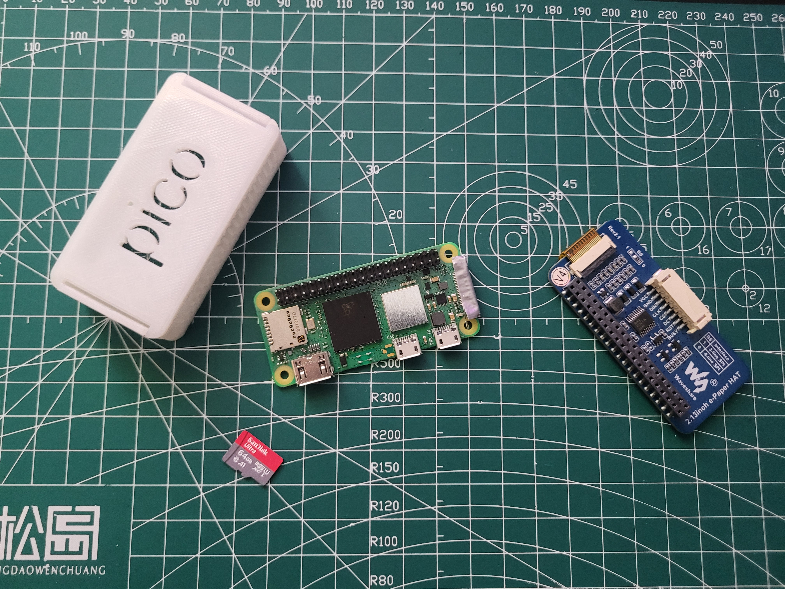

# Pwnagotchi (◕‿‿◕)

Ideally all the software used would be on my Github, but lets see.

# Important websites

1. reddit
2. pwnagotchi.org
3. pwnagotchi.ai

# Steps

1. Assemble hardware
2. Download and flash image
3. Add config.toml
4. Connect to Ethernet
5. Connect to bluetooth
6. 3D print case

# Assemble hardware

I have acquired a Raspberry zero 2W on Aliexpress, the overwall price was about R$200. Also you need a micro SD card with more than or equal to 32 Gb. And finally a screen. The most used screen are Waveshares e-ink. Mine is allegedly V4, however I’ve seen many people say it is usually mislabled and is actually a V3. In anyway it worked fine with the V3 setup.

# Download and flash image

## Finding the right image

I’ve used Jayofelony’s 2.8.9 image: https://github.com/jayofelony/pwnagotchi/releases. There is a more recent release now.

## Flashing the image

I used Balena Etcher (https://askubuntu.com/questions/1520383/how-to-run-balena-etcher-on-ubuntu-20-04) to flash the Jayo’s image into my SD card. I previously had flashed it with RaspOs but I don’t think it had any effect. I used an USB addapter, for my SD reader didn’t seam to work.

# config.toml

- You will add this in the main boot directory where all the files are.
- This is the only thing you will need to write on the image, the original one can be found at: https://pwnagotchi.ai/configuration/
- However this code has some alterations that mada possible my pwnagotchi to work.
    - note the `ui.fps = 0.5` line that is necessary for the upload of the pwnagotchi

```toml
main.name = "dukegotchi"
main.lang = "en"
main.whitelist = [
"YOUR_WIFI_NAME",
"fo:od:ba:be:fo:od",
"fo:od:ba"
]

main.plugins.grid.enabled = true
main.plugins.grid.report = true
main.plugins.grid.exclude = [
"YourHomeNetworkHere"
]

ui.display.enabled = true
ui.display.type = "waveshare_3"

ui.invert = true

ui.fps = 0.5
ui.display.color = "black"

ui.faces.look_r = "( ◌_◌)"

ui.faces.look_l = "(☹_☹ )"

ui.faces.look_r_happy = "( ◆‿◆)"

ui.faces.look_l_happy = "(◆‿◆ )"

ui.faces.sleep = "(⇀‿‿↼)"

ui.faces.sleep2 = "(≦‿‿≦)"

ui.faces.awake = "(◕‿‿◕)"

ui.faces.bored = "(-__-)"

ui.faces.intense = "(°◃◃°)"

ui.faces.cool = "(⌐□_□)"

ui.faces.happy = "(•‿‿•)"

ui.faces.excited = "(ᵔ□□ᵔ)"

ui.faces.grateful = "(^‿‿^)"

ui.faces.motivated = "(☀‿‿☀)"

ui.faces.demotivated = "(≦__≦)"

ui.faces.smart = "(✜‿‿✜)"

ui.faces.lonely = "(ب__ب)"

ui.faces.sad = "(╥☁╥ )"

ui.faces.angry = "(-_-')"

ui.faces.friend = "(♥‿‿♥)"

ui.faces.broken = "(☓‿‿☓)"

ui.faces.debug = "(#__#)"

ui.faces.upload = "(1__0)"

ui.faces.upload1 = "(1__1)"

ui.faces.upload2 = "(0__1)"

main.plugins.bt-tether.enabled = true

main.plugins.bt-tether.devices.android-phone.enabled = true           # the name of this entry is android-phone
main.plugins.bt-tether.devices.android-phone.search_order = 1         # in which order the devices should
                                                                      ## be searched. E.g. this is #1
main.plugins.bt-tether.devices.android-phone.mac = "XX:XX:XX:XX:XX:XX"# you need to put your phones
                                                                      ## bt-mac here (settings > status)
main.plugins.bt-tether.devices.android-phone.ip = "192.168.44.44"     # this is the static ip of your pwnagotchi
                                                                      ## adjust this to your phones pan-network
                                                                      ## (run "ifconfig bt-pan" on your phone)
                                                                      ## if you feel lucky,
                                                                      ## try: 192.168.44.44 (Android) or
                                                                      ## 172.20.10.6 (iOS)
                                                                      ## 44 is just an example, you can choose
                                                                      ## between 2-254 (if netmask is 24)
main.plugins.bt-tether.devices.android-phone.netmask = 24             # netmask of the PAN
main.plugins.bt-tether.devices.android-phone.interval = 1             # in minutes, how often should
                                                                      ## the device be searched
main.plugins.bt-tether.devices.android-phone.scantime = 10            # in seconds, how long should be searched
                                                                      ## on each interval
main.plugins.bt-tether.devices.android-phone.max_tries = 10           # how many times it should try to find the
                                                                      ## phone (0 = endless)
main.plugins.bt-tether.devices.android-phone.share_internet = true    # set to true if you want to have
                                                                      ## internet via bluetooth
main.plugins.bt-tether.devices.android-phone.priority = 1             # the device with the highest
                                                                      ## priority wins (1 = highest)

main.plugins.bt-tether.devices.ios-phone.enabled = false              # next device...
main.plugins.bt-tether.devices.ios-phone.search_order = 2
```

# Connecting to Ethernet

## On the pwnagotchi

This was a big pain because there are a lot of problems that can happen here, like:

1. USB being just power not data
2. PC doesn’t have the RNDIS keys
3. Any of the previous steps were wrong

But it weren’t any of those problems what happened to me, actually it was that the port that I was using on my PC was trashed and all the other ports were also shit (or I wasn’t waiting enough time, idk). A good trick to have up your sleeve is to check if the USB with the gotchi is connected using `lsblk`.

Eventually I was able to partially connect the Ethernet (it remained on “connecting...”). However I found a bash script somewhere that solved this issues with a few tweaks (needed to run as sudo):

```bash
#!/usr/bin/env bash
# Edited by Doctor X - @xNigredo -- t.me/pwnagotchiitalia
set -e

# pwnagotchi ip address for ssh connection
GOTCHI_ADDR=pi@10.0.0.2
# dns you want to use (es: 1.1.1.1)
YOUR_DNS=1.1.1.1

# name of the ethernet gadget interface on the host
USB_IFACE=${6:-enx86ffae88fbb4}
USB_IFACE_IP=10.0.0.1
USB_IFACE_NET=10.0.0.0/24
# host interface to use for upstream connection
UPSTREAM_IFACE=${3:-wlp3s0}

ip addr flush "$USB_IFACE"

ip addr add "$USB_IFACE_IP/24" dev "$USB_IFACE"
ip link set "$USB_IFACE" up

iptables -A FORWARD -o "$UPSTREAM_IFACE" -i "$USB_IFACE" -s "$USB_IFACE_NET" -m conntrack --ctstate NEW -j ACCEPT
iptables -A FORWARD -m conntrack --ctstate ESTABLISHED,RELATED -j ACCEPT
iptables -t nat -F POSTROUTING
iptables -t nat -A POSTROUTING -o "$UPSTREAM_IFACE" -j MASQUERADE

echo 1 > /proc/sys/net/ipv4/ip_forward

ssh "$GOTCHI_ADDR" "echo nameserver $YOUR_DNS | sudo tee -a /etc/resolv.conf"
```

The main issue was on this line `USB_IFACE=${6:-enx86ffae88fbb4}` because the pwnagotchi adress is mutable and to find its adress you need to CLI this: `ip link` . While the ethernet is connecting you can `ip link` it and find something that starts with `enx…` then change it on the bash and run it. The bash is also in this repo.

Then you just have to ssh into it `ssh pi@10.0.0.2` to change the pi password (first ping this and see if it is all working) . It is by default “raspberry” and I changed to my Linux password.

We should define a standart name to the gotchi.

## On the PC

Once all the prerequisites on the pwnagotchi are fulfilled, and you are sure the ethernet is connected, just run `10.0.0.2:8080` on your browser and you will reach the website. The default username and password are both **“changeme”**. Once everything is typed you will be able to access your pwnagotchi from the web browser.

## On the phone

My advice is that you connect on the phone after the PC connection. It is interesting to enable the pwnagotchi to display bluetooth connection before trying to connect it.

After that follow the steps available in  https://pwnagotchi.org/common-issues/index.html :

1. SSH into your pwnagotchi
2. run `sudo bluetoothctl`
3. run `scan on`. Find your phone either by it’s name, or MAC address. You will need only MAC address, so the best you can do is to find it in your phone.
4. run `pair <mac>`, where `<mac>` is your phone’s BT MAC address.
5. run `trust <mac>`, where again, `<mac>` is your phone’s BT MAC address.
6. In a few moments, you should be prompted (on your phone) to allow communication with pwnagotchi.
7. If the problem still persists, try untrusting and unpairing pwnagotchi from your phone, rebooting both devices and repeating process.

To be sincere, I tried it only once and was able to connect the pwnagotchi to the phone but not keep it connected. However, after some time the pwnagotchi asked to connect and kept connected. After that, type `192.168.44.44:8080` on your browser and use the username and password **“changeme”.**

##

- Materials used on the project:

<br><br><br><br><br><br><br><br><br><br><br><br><br><br><br><br><br><br>

- Finished project:


